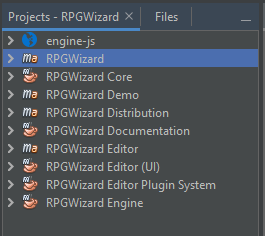

# RPGWizard  

====================================

### About RPGWizard
RPGWizard is an open-source 2D game creation tool that specialises in making RPGs. It comes with a graphical editor and browser based game engine, both of which are completely free-to-use.

### Features
- Asset Management: Provides an easy means of creating and managing all the game assets you'll be needing (e.g. Boards, Characters, Sprites, Animations) and much more.

- Browser Based: Run games on any desktop that has Chrome, Firefox, or Edge for maximum exposure.

- JavaScript Programming: All game code is in JavaScript which one of the most popular languages on the web today and very well documented.

### Download
Head over to the official site for the latest version and documentation: http://rpgwizard.org

### Community
Here at RPGWizard we believe in building a creative and helpful community for our users:

- Dedicated Forums: Reach out to other users of RPGWizard for help and feedback on all sorts of topics.

- Discord Channel: Join our Discord channel to get in touch with others quickly.

### Building from Source
In order to build the RPGWizard yourself you should be familiar with Java, Maven, JavaScript, and NodeJS.

#### Software Dependencies
* **Java 11+**
  * Azul Zulu highly recommended over Oracle see: https://www.azul.com/downloads/zulu-community
* **Java & JavaScript IDE**
  * Apache NetBeans recommended https://netbeans.apache.org/download/index.html
  * Turn on Web support for JavaScript editing, otherwise a Vanilla install is fine.
* **Maven 3.5.0+**
  * Included if using NetBeans as primary IDE

#### Project Structure
The RPGWizard is built up using a series of **Maven Modules** and a HTML web project
for the engine. The entire project can be built using the parent RPGWizard module:

#### Binary Dependencies
RPGWizard depends on [Java Chromium Embedded Framework (JCEF) ](https://github.com/chromiumembedded/java-cef)
for its game engine, in order to build and run the engine on Windows you need
to download and place the pre-compiled binaries into the following location:

* _rpgwizard/engine/src/main/resources/lib/_

##### JCEF Binaries
* https://github.com/swordmaster2k/rpgwizard/releases/tag/1.7.0-dependencies

#### Main Class
The main runnable class for the RPGWizard is located at:

* _rpgwizard/editor/editor-ui/src/main/java/org/rpgwizard/editor/Driver.java_

### Credits
RPGWizard is an open source project, and is supported by its community. It owes its heritage to the RPGToolkit, from which it was originally forked.

The RPGWizard team is lead by Joshua Michael Daly.

Some icons by:

* Yusuke Kamiyamane. Licensed under a Creative Commons Attribution 3.0 License.
* Icons8. Licensed under a Creative Commons Attribution-NoDerivs 3.0 Unported.
